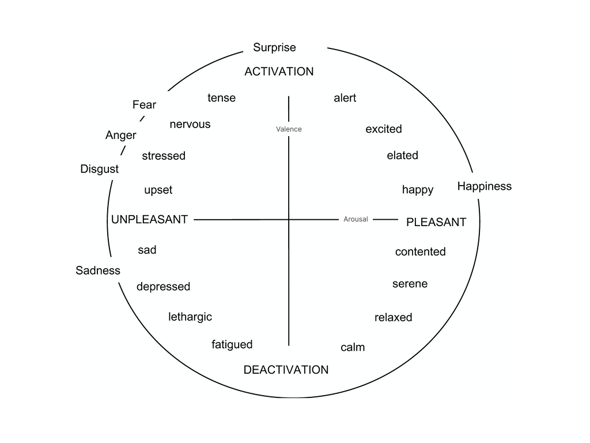

# 🧠 Neural Affect Matrix For NPCs

[](https://opensource.org/licenses/MIT)
[](https://www.rust-lang.org/)

<!-- [](https://github.com/your-repo/npc-neural-affect-matrix) -->

**Give each NPC persistent emotions and dynamic personalities that evolve through interactions, creating more immersive and believable game experiences.**

---

## 🎯 What is Neural Affect Matrix?

Traditional NPCs rely on conditional logic and don't understand the source of their actions. This often leads to bugs or incoherent decisions that break immersion and make characters feel artificial. The goal is to make NPCs more human by giving them emotions as an important source of their behavior. Emotions that persist over time, creating unique personalities through experiences.

The system works as a simple api for any game engine or modding tools. You can instantly check how any NPC feels about specific characters or entity, then use that emotional data to create more believable interactions.

**Here's what makes NPCs unique:**

- **🧠 Emotional Understanding**: NPCs grasp the emotional meaning behind conversations and actions
- **💭 Emotional Memory**: Every interaction shapes how they feel in the future
- **🎭 Evolving Personalities**: Characters change and grow based on their experiences
- **🔄 Complex Relationships**: NPCs can love some characters or entity while disliking others, just like real people

### How Emotions Actually Work

Think about how humans work: we feel first, then rationalize our decisions. NPCs should work the same way.

We use **Russell's Circumplex Model**, a proven scientific framework that maps human emotions onto a simple 2D coordinate system:

- **Valence** (X-axis): How pleasant or unpleasant the emotion feels (-1 to +1)
- **Arousal** (Y-axis): How energetic or calm the emotion is (-1 to +1)

This creates an emotional landscape where every feeling can be precisely mapped and tracked over time.



🔗 **Visualize emotions**: <a href="https://valence-arousal-visualizer.vercel.app/" target="_blank">Interactive Valence-Arousal Explorer</a>

---

## ⚡ The Process Flow

```
[ Input Text ] → [ Neural Affect ML Model ] → [ Memory Retrieval ] →
[ Contextual Re-evaluation ] → [ Emotional Response (Valence, Arousal) ]
```

1. **Emotion from text**: The model evaluates valence/arousal of the text.
2. **Memory Integration**: Retrieves relevant past interactions
3. **Reevaluate Emotion**: Use memory to reevaluate valence/arousal
4. **Local Storage**: Updates memory with new emotional data

**Language Support**: Currently optimized for English text

---

## 🚀 Getting Started

**Build for production**

Since the majority of video game engines run on Windows, we've streamlined the build process to make integration as simple as possible.

```bash
chmod +x build.sh
./build.sh
```

**Find your binaries**

```
📁 dist/
├── npc_neural_affect_matrix.dll     # Main file
├── onnxruntime.dll                  # AI runtime
└── onnxruntime_providers_shared.dll # AI providers
```

_**Note**: Docker is required to execute build.sh_

---

## 🛠️ Development

### Project Structure

```
src/
├── api/              # C API endpoints
│   ├── services/     # Files that contain functions that communicate with modules
│   ├── endpoints.rs  # All the functions that we can call
│   └── type.rs       # The default types used
├── modules/
│   ├── emotion/      # Neural emotion prediction
│   └── memory/       # Memory management
├── models/           # Input/output data structures
├── config/           # Configuration handling
└── utils/            # Utilities and setup
```

---

## 🧩 API References
The Neural Affect Matrix provides a C API for seamless integration with game engines like Unity, Unreal Engine, and other C/C++ applications.

##### `initialize_neural_matrix`

Initializes the shared neural model that powers emotion prediction. This function must be called before using any other API functions to ensure the AI model is properly loaded and ready for use.

```c
ApiResult* initialize_neural_matrix();
```

**Response Fields:**

- **Response** (string): Confirmation message indicating successful model initialization

**Important Notes:**

- This function should be called once at application startup
- Must be called before creating any NPC sessions
- If initialization fails, all subsequent API calls will fail

##### `create_npc_session`

Initializes a new NPC session with unique emotional state and memory storage. Each session represents an independent NPC instance that can maintain its own relationships, memories, and emotional evolution.

```c
ApiResult* create_npc_session(
    const char* config_json,
    const char* npc_memory_json
);
```

**Parameters:**

- **`config_json`** (const char\*): JSON string containing NPC configuration (required)
  - Must be valid JSON matching the configuration structure
  - Cannot be NULL or empty
- **`npc_memory_json`** (const char\*): JSON string containing existing memory data (optional)
  - Pass NULL for new NPCs with no prior history
  - Use exported memory from `get_npc_memory()` to restore saved NPCs

**Response Fields:**

- **`npc_id`** (string): Unique identifier for the NPC session, required for all subsequent API calls

#### `remove_npc_session`

Cleanly removes an NPC session and frees all associated memory. This permanently deletes the NPC's emotional state and memory history.

```c
ApiResult* remove_npc_session(const char* npc_id);
```

**Parameters:**

- **`npc_id`** (const char\*): Unique NPC session identifier (required)
  - Must be a valid UUID string returned from `create_npc_session`
  - Cannot be NULL or empty

**Response Fields:**

- **Response** (string): Confirmation message indicating successful removal

#### `evaluate_interaction`

The core function that processes text input through the neural emotion prediction model, integrates it with the NPC's memory, and returns an emotional response. This function updates the NPC's memory with the new interaction.

```c
ApiResult* evaluate_interaction(
    const char* npc_id,
    const char* text,
    const char* source_id
);
```

**Parameters:**

- **`npc_id`** (const char\*): NPC session identifier (required)
  - Must be a valid UUID from an active session
- **`text`** (const char\*): Input text to process (required)
  - Can be dialogue, actions, or events
  - Supports up to 512 characters
  - Works best with English text
- **`source_id`** (const char\*): Identifier for who/what is causing this interaction (optional)
  - Pass NULL for anonymous interactions
  - Use consistent IDs (e.g., "player", "merchant", "enemy_orc") for relationship tracking

**Response Fields:**

- **`valence`** (float, -1.0 to 1.0): Emotional pleasantness/unpleasantness of the response
- **`arousal`** (float, -1.0 to 1.0): Emotional energy/calmness of the response

#### `get_current_emotion`

Retrieves the NPC's current overall emotional state by calculating the weighted average of all memories, with recent interactions having more influence.

```c
ApiResult* get_current_emotion(const char* npc_id);
```

**Parameters:**

- **`npc_id`** (const char\*): NPC session identifier (required)

**Response Fields:**

- **`valence`** (float, -1.0 to 1.0): Emotional pleasantness/unpleasantness of the response
- **`arousal`** (float, -1.0 to 1.0): Emotional energy/calmness of the response

#### `get_current_emotion_by_source_id`

Retrieves the NPC's emotional state toward a specific character or entity, based only on interactions with that source.

```c
ApiResult* get_current_emotion_by_source_id(
    const char* npc_id,
    const char* source_id
);
```

**Parameters:**

- **`npc_id`** (const char\*): NPC session identifier (required)
- **`source_id`** (const char\*): Identifier for the specific source (required)

**Response Fields:**

- **`valence`** (float, -1.0 to 1.0): Emotional pleasantness/unpleasantness of the response
- **`arousal`** (float, -1.0 to 1.0): Emotional energy/calmness of the response

#### `get_npc_memory`

**Description**: Exports all memory data for an NPC in JSON format. This is essential for save/load systems and debugging emotional state.

```c
ApiResult* get_npc_memory(const char* npc_id);
```

**Parameters:**

- **`npc_id`** (const char\*): NPC session identifier (required)

**Response Format:**

```json
[
  {
    "id": "mem_001",
    "source_id": "player_character",
    "text": "Thank you for saving my family",
    "valence": 0.85,
    "arousal": 0.45,
    "past_time": 1440
  }
]
```

#### `clear_npc_memory`

**Description**: Permanently deletes all memory entries for an NPC, effectively resetting their emotional state to the base personality.

```c
ApiResult* clear_npc_memory(const char* npc_id);
```

**Parameters:**

- **`npc_id`** (const char\*): NPC session identifier (required)

#### `free_api_result`

**Description**: **Critical function** that must be called after every API function to prevent memory leaks. Failure to call this will cause memory accumulation.

```c
void free_api_result(ApiResult* result);
```

**Parameters:**

- **`result`** (ApiResult\*): Pointer returned from any API function (required)

---

## 📊 Types

### ApiResult structure

All functions return an `ApiResult` structure that provides error handling and data management:

```c
typedef struct {
    bool success;       // Operation success status
    char* data;         // JSON response data (on success)
    char* error;        // Error message (on failure)
} ApiResult;
```

**Field Descriptions:**

- **`success`** (bool): `true` if operation completed successfully, `false` if an error occurred
- **`data`** (char\*): JSON-formatted response data when `success` is `true`, `NULL` when operation fails
- **`error`** (char\*): Human-readable error message when `success` is `false`, `NULL` on successful operations

**Configuration Fields:**

- **`identity.name`** (string): Display name for the NPC, used in logging and debugging
- **`identity.background`** (string): Character backstory that influences emotional responses and provides context for interactions
- **`personality.valence`** (float, -1.0 to 1.0): Default emotional disposition on the pleasant/unpleasant axis. Positive values create optimistic characters, negative values create pessimistic ones
- **`personality.arousal`** (float, -1.0 to 1.0): Default energy level on the calm/excited axis. Positive values create energetic characters, negative values create calm ones
- **`memory.decay_rate`** (float, 0.0 to 1.0): Rate at which old memories fade over time. Higher values make NPCs forget faster, lower values create longer-lasting impressions

#### NPC Configuration Structure

NPCs are configured using JSON with the following structure:

```json
{
  "identity": {
    "name": "Village Guard",
    "background": "A loyal guard who protects the village from threats. Has served for 15 years and takes pride in maintaining order."
  },
  "personality": {
    "valence": 0.2,
    "arousal": -0.1
  },
  "memory": {
    "decay_rate": 0.1
  }
}
```

### Memory Structure

Each NPC maintains a local memory of interactions:

```json
{
  "source_id": "player_character",
  "text": "Thank you for saving my life",
  "valence": 0.85,
  "arousal": 0.45,
  "past_time": 1440
}
```

**Fields Explained**:

- `source_id`: Who/what caused this emotional memory
- `valence`/`arousal`: Emotional coordinates for this specific interaction
- `past_time`: Game time elapsed (in minutes) when this occurred
- Memory naturally decays over time based on `decay_rate`

---

## 🤝 Contributing

We welcome contributions! Here's how to get started:

1. **Fork** the repository
2. **Create** a feature branch: `git checkout -b feature/amazing-feature`
3. **Make** your changes and add tests
4. **Test** your changes: `cargo test`
5. **Open** a Pull Request

---

## 📚 Resources & Research

### AI Models

- **Model**: [NPC Valence-Arousal Prediction (ONNX)](https://huggingface.co/Mavdol/NPC-Valence-Arousal-Prediction-ONNX)
- **Training Dataset**: [NPC Valence-Arousal Dataset](https://huggingface.co/datasets/Mavdol/NPC-Valence-Arousal) (1K+ video game dialogues)
- **Upcoming**: Expanded dataset with 100K+ samples in development

### Scientific Background

- Russell's Circumplex Model of Affect
- Memory decay and emotional persistence research

---

## 📄 License

This project is licensed under the MIT License - see the [LICENSE](LICENSE) file for details.

---

## 🆘 Support

- **Issues**: [GitHub Issues](https://github.com/mavdol/npc-neural-affect-matrix/issues)
- **Discussions**: [GitHub Discussions](https://github.com/mavdol/npc-neural-affect-matrix/discussions)
